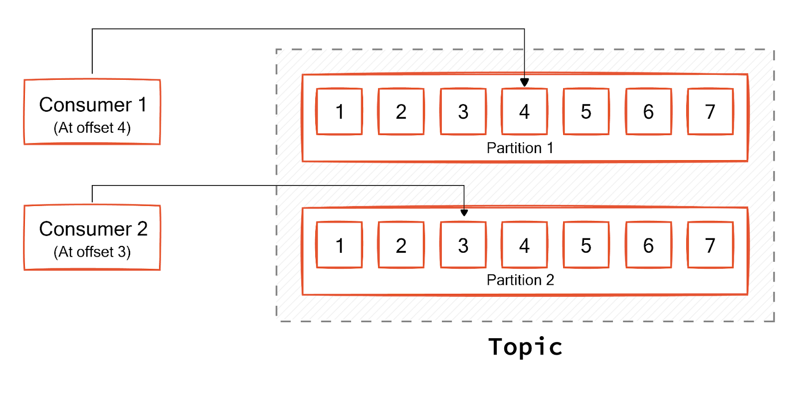

## Why are Kafka offsets necessary?

Multiple producers can write messages to a Kafka topic simultaneously, and multiple consumers can process messages from a topic parallelly. A consumer group is a set of consumers that consume from the same topic. Kafka ensures that a partition is assigned to only one consumer at a time. This helps Kafka remove the complexities of sharing messages within a single partition with multiple consumers.

The only remaining problem is ensuring the consumers get reliable data from the assigned partitions. This is where offsets come into the picture.

Kafka uses offsets to track messages from initial writing to final processing completions. Thanks to offsets, Kafka ensures consumers fetch messages in the same order producers write them. Your system can also recover gracefully from failures and continue from the exact point of failure.

While every message has its own offset, specific terms are used to track key offsets in the stream.

- Log-end-offset is the last message present in a Kafka partition
- High watermark offset is the point of the log up to which all messages are synced to partition replicas.
- Committed offset indicates the last message a consumer successfully processed.

## What is a Kafka offset?
Kafka’s operational structure consists of producers, consumers, and the broker.

Producers are applications that produce messages to Kafka topics.
Kafka broker receives messages from producers and stores them durably.
Consumers are applications that read the data in Kafka topics.
A Kafka topic is a logical group of data that deals with a specific business objective. The topics are divided into partitions to aid parallelism. Kafka keeps track of the messages in a partition using an identifier called offset. Every message has its own unique offset or identifier value.

Internally, Kafka writes messages to logs, and the Kafka offset represents the position of a message within that partition’s log. It indicates how far the message is from the beginning of the partition log.

## Message delivery guarantees with Kafka offsets
By default, Kafka pulls in a micro-batch of messages and commits the offset at periodic intervals. This mechanism is called the auto-commit strategy. In auto-commit mode, Kafka does not guarantee message delivery. Depending on the failure scenarios, messages may get lost or be delivered more than once. The producer simply fires and forgets the messages.

Tweaking configurations related to offset committing can establish stricter message delivery guarantees. However, it depends on both producer and consumer settings. Kafka supports three kinds of delivery guarantees.

### At most once
You set the producer acknowledgment configuration parameter ‘acks’ to ‘1’ or ‘all.’ On the consumer side, offsets are committed as soon as the message arrives, even before processing them. In this case, consumer failure during processing may result in lost messages, but no messages are processed more than once.

### At least once
At-least-once guarantee ensures that no message will be missed, but there is a chance of messages being processed more than once. You enable producer acknowledgment and implement consumers such that they commit offset only after processing the messages. Consumer failure can result in messages being processed twice, but the risk of losing messages is very low.

### Exactly once
Exactly once semantics ensure that there are no lost messages or duplicate messages. You use the idempotence configuration in the producer to prevent it from sending the same message twice to a partition.

Configure the parameter *enable.idempotence=true* in your producer.
Set the parameter *processing.guarantee=exactly_once* in your stream application.
At the time of writing, this is possible only when the consumer’s output is sent to a Kafka topic itself and not to other remote syncs. In this case, the offset commit and the consumer processing of messages happen as a single transaction, thereby removing the possibility of a message being processed twice on the consumer side. If the transaction fails, all its effects are reverted, making the whole action atomic.