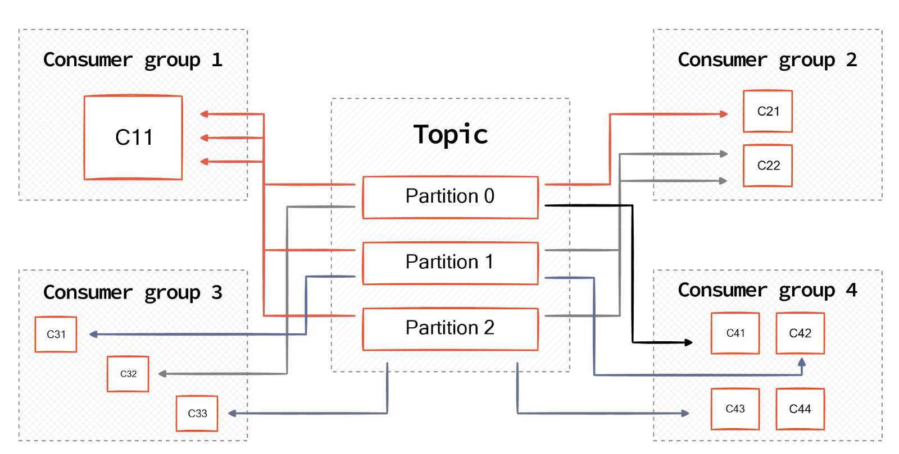
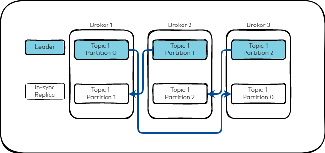

# Summary of Kafka partition concepts
Kafka lets you choose how producers publish messages to partitions and how consumers are assigned to partitions. There are multiple ways to achieve this, with its own pros and cons. The table below summarises important partitioning strategies.

| **Producer Partition Strategies** | **Description** |
|-----------------------------------|-----------------|
| **Default**                       | A key hash maps messages to partitions. The key is passed into a hash function which takes the hash value of the key and determines the partition the message belongs to. |
| **Round-robin**                   | Messages map to partitions in a round-robin fashion. Messages with the key set to null get mapped to partitions in a round-robin style. |
| **Sticky**                        | The producer request that takes the partition as an input always routes the record to the partition. Messages are sent within batch size and time constraints to reduce latency. |
| **Custom**                        | Implements an interface that overrides the Kafka partition method with custom logic to define the key-to-partition routing strategy. |

| **Consumer Assignment Strategies** | **Description** |
|------------------------------------|-----------------|
| **Range (default)**                | Assigns the same partition number to the same consumer (e.g., the same consumer reads from P0 of Topic X and P0 of Topic Y). |
| **Round-robin**                    | Partitions are individually assigned to consumers (in a sequential order, e.g., from first to last). |
| **Sticky**                         | Works similarly to round-robin assignment but preserves as many existing assignments as possible. |
| **Custom**                         | Extends the AbstractPartitionAssignor class to override the assign method with custom logic. |

https://www.redpanda.com/guides/kafka-architecture-kafka-partition

## Kafka Replication and Partition

Apache Kafka® replicates the event log for each topic’s partitions across a configurable number of servers. This replication factor is configured at the topic level, and the unit of replication is the topic partition. This enables automatic failover to these replicas when a server in the cluster fails so messages remain available.

Under non-failure conditions, each partition in Kafka has a single leader and zero or more followers. In Kafka, all topics must have a replication factor configuration value. The replication factor includes the total number of replicas including the leader, which means that topics with a replication factor of one (1) are topics that are not replicated.

All reads and writes go to the leader of the partition.

Typically, there are many more partitions than brokers and the leaders are evenly distributed among brokers. The logs on the followers are identical to the leader’s log; all have the same offsets and messages in the same order. Although at any given time, the leader may have a few unreplicated messages at the end of its log.

The following image shows a topic with three partitions and how they might be replicated across three brokers.

Followers consume messages from the leader like a Kafka consumer would and apply them to their own log. Followers pulling from the leader enables the follower to batch log entries applied to their log.

As with most distributed systems, automatically handling failures requires having a precise definition of what it means for a node to be alive. For Kafka node to be considered alive, it has to meet two conditions

A node must be able to maintain its session with the controller
If it is a follower it must replicate the writes happening on the leader and not fall “too far” behind
These nodes are called “in sync” versus “alive” or “failed”. The leader keeps track of the set of in-sync nodes. If a follower fails, gets stuck, or falls behind, the leader will remove it from the list of in-sync replicas. The replica.lag.time.max.ms configuration specifies what replicas are considered stuck or lagging.

In distributed systems terminology, Kafka attempts to handle “fail/recover” scenarios where nodes suddenly cease working and then later recover, but does not handle Byzantine failures, in which nodes produce arbitrary or malicious responses due to foul play or bugs.

## Replica management

The previous section on replicated logs covers a single log, in other words, one topic partition. However a Kafka cluster manages hundreds or thousands of these partitions. Kafka attempts to balance partitions within a cluster in a round-robin fashion. This avoids clustering all partitions for high-volume topics on a small number of nodes. Likewise, Kafka also tries to balance leadership so that each node is the leader for a proportional share of its partitions.

The leadership election process is the critical window of unavailability, and must be optimized. To accomplish this, one of the brokers is elected as the “controller”. This broker controller detects failures at the broker level and changes the leader of all affected partitions when a broker fails. The result is leadership change notifications are batched, which makes the election process fast for a large number of partitions. If the controller fails, one of the surviving brokers will become the new controller.